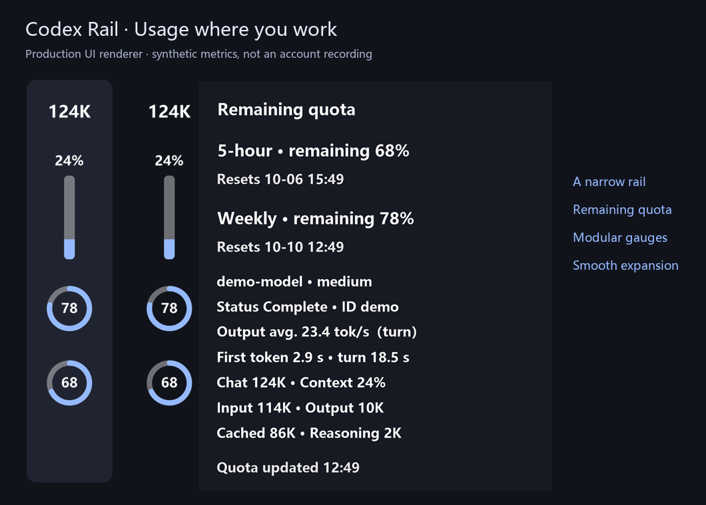
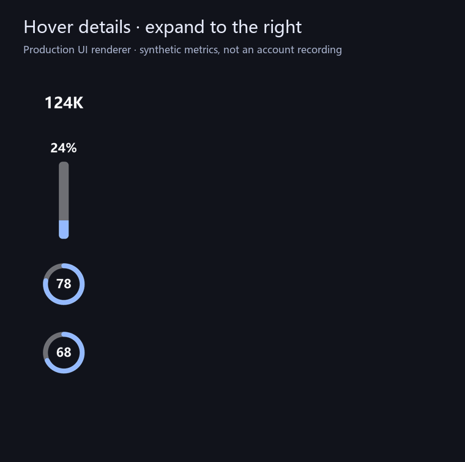
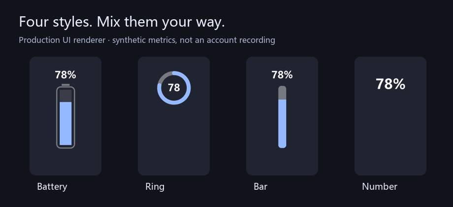
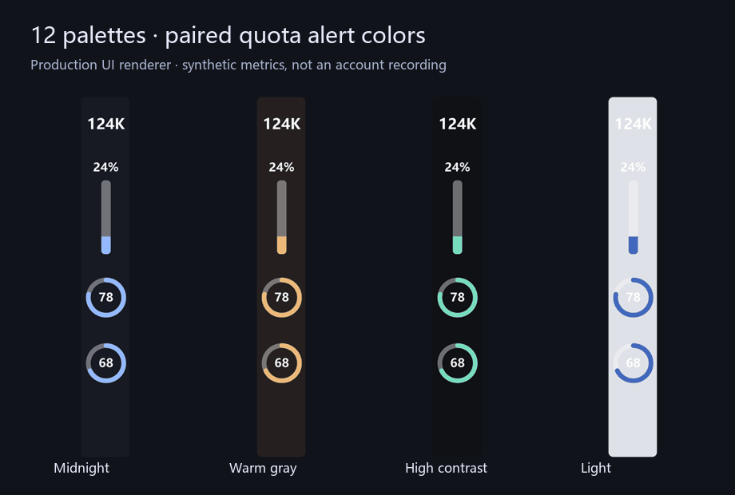
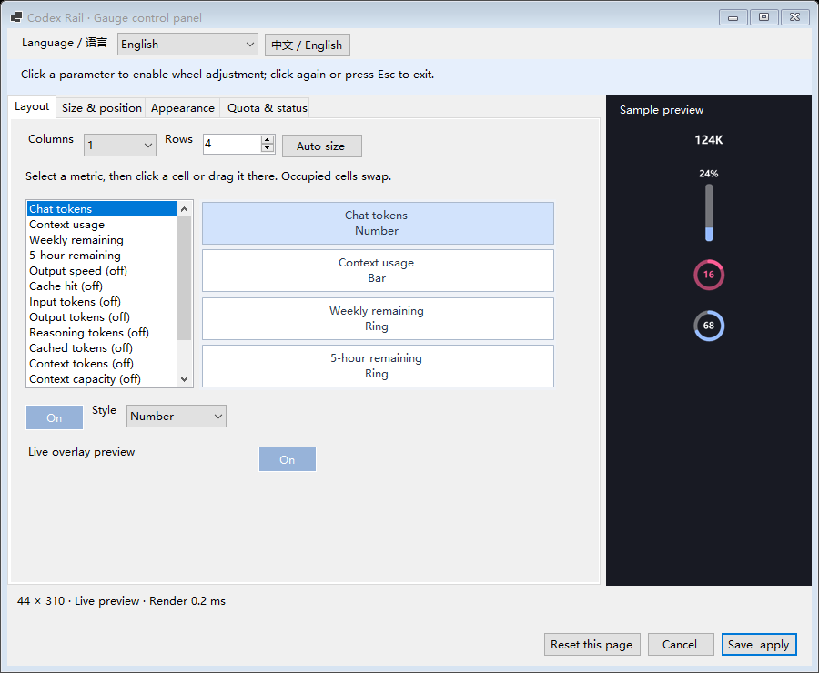

# Codex Rail

[English](README.md) · [简体中文](README.zh-CN.md)

**Usage where you work. A sidecar that hopes to retire.**

A small Windows companion that places Codex quota and session metrics in the narrow left rail. Built to become unnecessary when Codex provides a native equivalent.



Windows 10/11 · x64 · C# / .NET 10 · [MIT](LICENSE) · Independent community project

## See it in action



The compact metrics stay in place while details expand to the right. This GIF uses frames from the production renderer and synthetic data; it is not a live account recording.

| At a glance | When you need more |
|---|---|
| Weekly and 5-hour **remaining** allowance | Separate reset timestamps, if provided |
| Chat token totals and context usage | Input, output, cached and reasoning token counters |
| Numeric, vertical bar, battery and ring modules | Per-module style and ring values inside / outside / hidden |
| Threshold-based alert colors | Optional session status, model and output speed |

Output speed is the **completed or ongoing turn average**, including tool and waiting time—not instantaneous streaming throughput. Missing quota is shown as `—`; it is never estimated.

## Make the rail yours



Mix modules rather than choosing one global gauge style. Arrange up to 3 columns and 16 rows, hide unused metrics, adjust ring/bar thickness, save vertical position and lock dragging. Small work areas use paging without rewriting your saved layout.



12 palettes, low-quota contrast colors, separate background/text settings, Codex light/dark text matching, font import and background images. The panel supports English, Chinese and system-language selection.



Live preview updates on edits; enabling it does not start a continuous animation loop. Settings and overlay adapt to DPI and the available work area. [Validation boundaries](docs/TESTING.md) describe what was simulated and what still needs physical-screen testing.

## Get started

1. Download the portable ZIP from this repository's **Releases** page and extract it. It includes both EXEs and license notices. Choose `CodexRail-win-x64-standalone.exe` if you do not have the .NET 10 Desktop Runtime; choose `CodexRail-win-x64.exe` if you do.
2. Keep the EXE in a stable folder and run it while using the Codex desktop app.
3. Right-click the rail or tray icon → **Control panel**. Choose your language and layout; **Save & apply** commits changes.

No installer is required. Codex and its signed-in runtime must already be available. Windows on ARM, macOS and Linux are not supported by this release. The initial binaries are unsigned. [Installation and troubleshooting](docs/INSTALL.md) cover runtime discovery, missing metrics and the smaller build.

The self-contained build is about **49 MiB** because it includes .NET/WinForms. The framework-dependent build is under **1 MiB** but relies on a shared runtime. Package size is not resident memory, and this project does not claim to match a native C++ utility's footprint.

## Data and compatibility

Quota comes from the local Codex app-server rate-limit method. Session metrics come from local session JSONL metadata and counters; the current page is identified by its Windows accessibility document title, uniquely matched to the local thread catalog (read only). Duplicate titles or unavailable page identity show unconfirmed metrics instead of selecting a background session. These session files can also contain prompts and responses. Codex Rail does not upload chat logs or ship analytics, and does not directly read authentication files. Codex itself handles the quota connection. [Data flow and privacy](docs/PRIVACY.md).

This is an **external overlay**, not an official Codex extension or a mounted sidebar component. IPC, log formats and sidebar geometry can change between Codex releases. A working weekly allowance does not imply the 5-hour field is available. Very small work areas hide the overlay rather than covering navigation buttons.

## Build and contribute

```powershell
./build.ps1
./build.ps1 -Standalone
./test.ps1
```

Requires Windows and the .NET 10 SDK. Production and test code are separate. See [contributing](CONTRIBUTING.md), [architecture](docs/ARCHITECTURE.md) and [release notes](CHANGELOG.md). [GitHub Actions](https://github.com/SeaserL/Codex-Rail/actions) runs build/test validation; version tags create release drafts for review.

<details>
<summary><strong>Why this project hopes to disappear</strong></summary>

I wanted to check usage with a glance, not a trip through the profile menu. The empty left rail seemed a natural home. This overlay is my imperfect answer—but its best ending would be a small native Codex switch that makes it unnecessary.

[Read the founder's note](docs/WHY.md) · [中文原文](docs/WHY.zh-CN.md)

</details>

## Credits

Based on [codex-token-overlay](https://github.com/soleillevant0125/codex-token-overlay), with its MIT notice retained. Interface and resource-management ideas were inspired by [TrafficMonitor](https://github.com/zhongyang219/TrafficMonitor); no TrafficMonitor code or assets were copied.

Codex Rail is not affiliated with or endorsed by OpenAI. Codex is an OpenAI product. All screenshots and GIFs here use fixture data; the overview background is illustrative, not a capture of a private Codex workspace.
