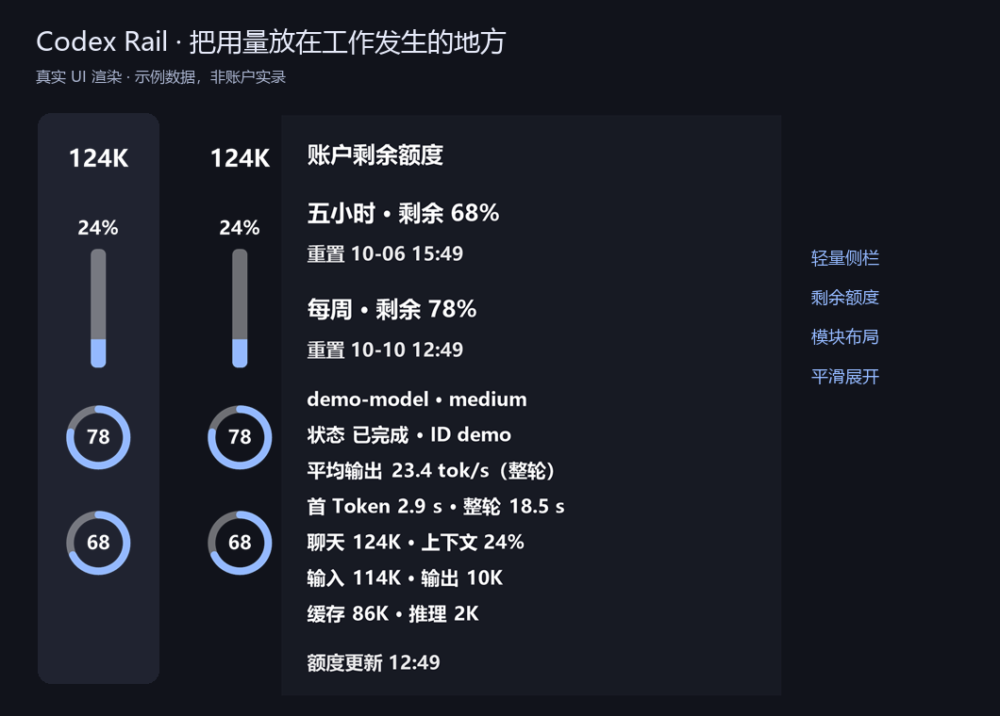
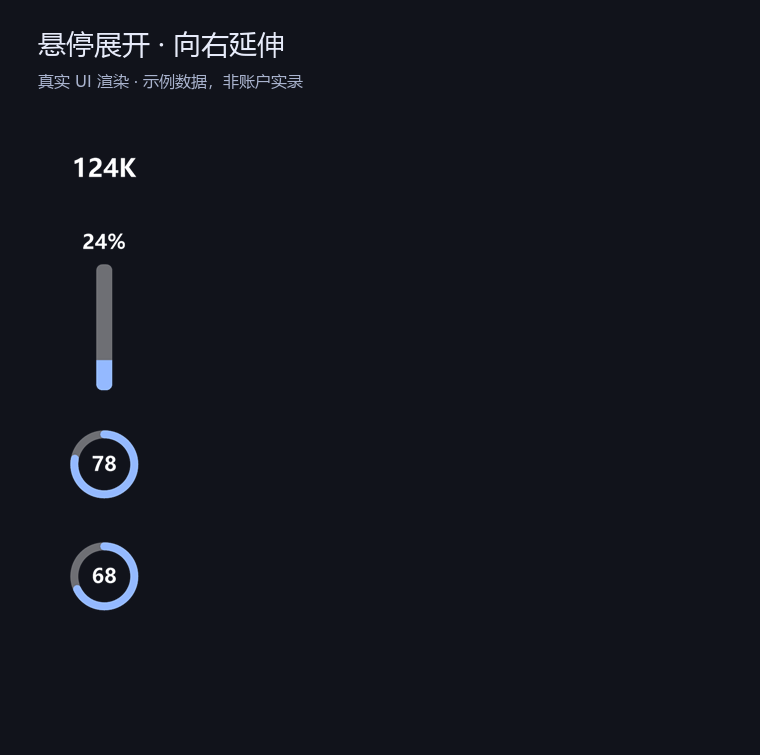
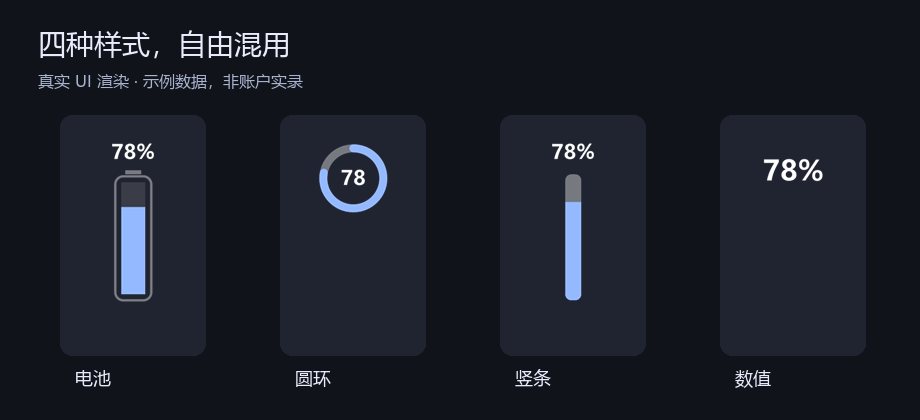
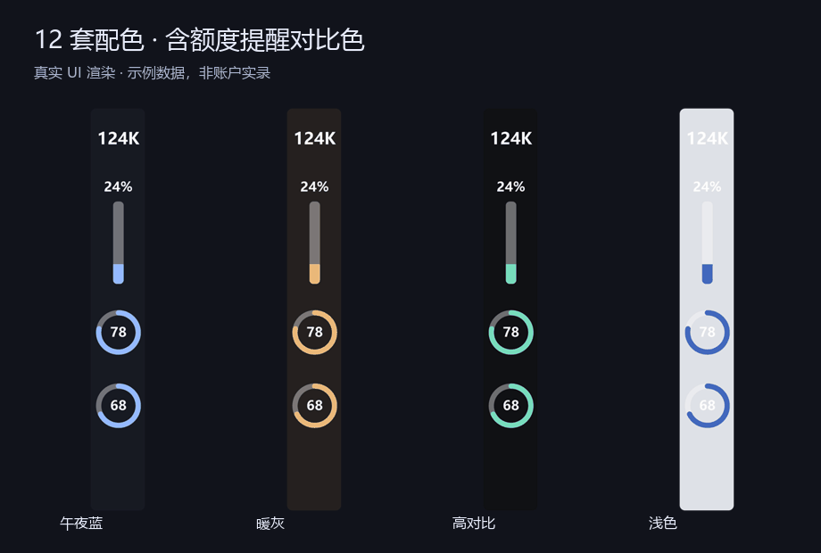
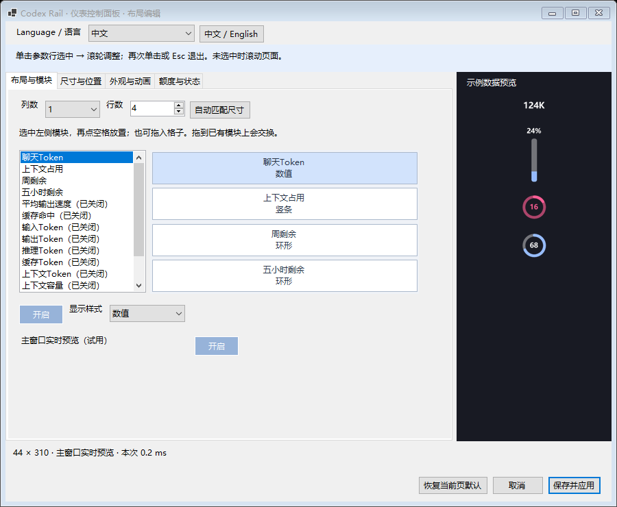

# Codex Rail · Codex 侧栏仪表

[English](README.md) · [简体中文](README.zh-CN.md)

**把用量放在工作发生的地方。一个盼望退休的侧栏仪表。**

一个尽可能轻量的 Windows Codex 用量浮窗。把额度和聊天指标安放在左侧窄栏；也期待某次原生更新，让它不再有存在的必要。



Windows 10/11 · x64 · C# / .NET 10 · [MIT 开源](LICENSE) · 独立社区项目

## 看一眼就知道，悬停再展开



紧凑区保持原位，详情从右侧展开。这段动图使用生产渲染器和虚构数据生成，不是实际账户录屏。

| 日常显示 | 展开详情 |
|---|---|
| 每周、五小时**剩余额度** | 各自的重置时间（接口提供时） |
| 当前聊天 Token 与上下文占用 | 输入、输出、缓存、推理计数 |
| 数值、竖条、电量条、圆环 | 每个模块独立选择；环内、环外或隐藏数值 |
| 低额度阈值变色 | 可选的模型、任务状态和平均输出速度 |

输出速度是**整轮平均值**，包含等待和工具耗时，不是瞬时流式速度。缺失的额度显示 `—`，不猜测、不估算。

## 模块与配色，由你决定



模块可混合使用，不必选一个全局仪表样式。最多 3 列、16 行，可关闭指标，调整环/条粗细，保存竖向位置并禁止拖动。空间不足时自动分页，不改写已经保存的布局。



12 组主题、配套低额度提醒色，背景与文字透明度分离，文字可跟随 Codex 明暗；支持导入字体和背景图片。设置页支持中文、英文及系统语言。



实时预览只在调整时更新，不会因为开关打开而持续逐帧重绘。窗口按 DPI 与工作区适配。[测试说明](docs/TESTING.md)列出了模拟测试范围和仍需物理屏幕验证的边界。

## 开始使用

1. 在本仓库的 **Releases** 页面下载并解压便携 ZIP，其中包含两个 EXE 与许可证。没有 .NET 10 Desktop Runtime 时运行 `CodexRail-win-x64-standalone.exe`；已有运行时则运行 `CodexRail-win-x64.exe`。
2. 将 EXE 放在固定文件夹，运行后使用 Codex 桌面版。
3. 右键仪表或托盘 → **控制面板**。选择语言、指标与布局，点击**保存并应用**。

无需安装器，需已有可登录的 Codex 桌面程序及运行时。本版不支持 Windows ARM、macOS 或 Linux。首版二进制未签名。运行时路径、指标缺失及其他问题见[安装与排查](docs/INSTALL.md)。

独立版约 **49 MiB**，主要是随包附带的 .NET/WinForms；小体积版低于 **1 MiB**，依赖共享运行时。包体积不等于常驻内存，这个项目也不宣称已经达到原生 C++ 工具的资源水平。

## 数据与兼容性

额度由本地 Codex app-server 的额度读取方法取得。聊天指标从本地 session JSONL 中解析元数据和计数，通过桌面 IPC 与日志回退确定会话。日志本身可能包含提示词和回复；本程序不上传聊天日志、不集成分析遥测，也不直接读取认证文件。额度的网络访问由 Codex 自己处理。详见[数据与隐私](docs/PRIVACY.md)。

这是**外部浮窗**，不是 OpenAI 官方插件，也不是原生侧栏挂载组件。Codex 更新可能改变 IPC、日志格式或界面边界。周额度正常不代表五小时字段也存在；极小工作区会隐藏浮窗，保护导航按钮。

## 编译与贡献

```powershell
./build.ps1
./build.ps1 -Standalone
./test.ps1
```

需要 Windows 与 .NET 10 SDK。生产代码与测试分离。欢迎阅读[贡献指南](CONTRIBUTING.md)、[架构](docs/ARCHITECTURE.md)和[更新记录](CHANGELOG.md)。[GitHub Actions](https://github.com/SeaserL/Codex-Rail/actions) 自动构建与验证；版本标签会生成供审阅的 Release 草稿。

<details>
<summary><strong>为什么我希望这个项目消失</strong></summary>

我想要随手看一眼用量，而不是绕进头像菜单。侧栏的留白似乎正适合放这些数字。这个浮窗是我的不完美答案，但更好的结局，是 Codex 多出一个原生小开关，让它从此不再有必要。

[阅读完整创作者自述](docs/WHY.zh-CN.md) · [English](docs/WHY.md)

</details>

## 致谢

基于 [codex-token-overlay](https://github.com/soleillevant0125/codex-token-overlay)，保留 MIT 版权声明。界面与资源管理思路受到 [TrafficMonitor](https://github.com/zhongyang219/TrafficMonitor) 启发，未复制其源码或素材。

Codex Rail 与 OpenAI 无隶属或背书关系。Codex 是 OpenAI 产品。图片和动图均使用示例数据；总览背景为示意图，不包含私人 Codex 工作区截图。
