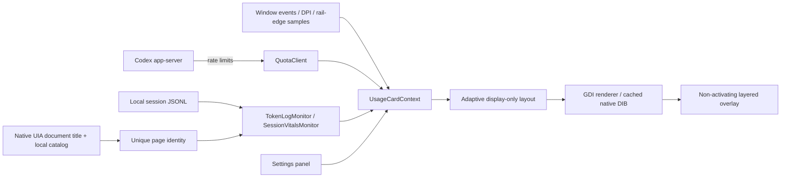

# Architecture / 架构

No web renderer is included. Quota refresh is approximately once a minute while displayed; the helper exits after a read. Session polling is every 500 ms while visible, with bounded/coalesced file notifications. Route changes immediately clear old metrics. Quota reads run independently, and stale session results are discarded. A separate MTA thread reads the host document title every 500 ms while visible; the native SQLite catalog is queried on title changes and every five seconds. Duplicate titles, unavailable providers and reads stale by more than 2.5 seconds invalidate identity. No newest-log fallback is used. Foreground/window events drive visibility and geometry, with fallback checks. Animation timers stop at completion. Configuration edits are debounced and trigger live preview only when changed.

没有网页渲染器。显示时约每分钟读额度，辅助进程读取后退出；显示时会话每 500 毫秒检查，文件通知合并且有上限；路由变化立即清除旧指标，额度独立读取，过期会话结果丢弃。独立 MTA 线程显示时每 500 毫秒读宿主文档标题；标题变化时和每五秒只读查询本地 SQLite 目录。同名、提供程序不可用或读取超过 2.5 秒未更新时，身份失效，不回退到最近日志。窗口事件驱动可见性与位置，另有补偿检查。动画结束即停止，设置预览由变更触发。

Namespaces, the configuration directory, startup registry key and single-instance mutex retain prototype names to keep existing preferences/startup behavior compatible. The public assembly and project are named Codex Rail. Session-log parsing and desktop IPC are version-sensitive; they are not presented as a stable extension API.

命名空间、配置目录、启动项和互斥锁保留历史标识以兼容已有设置；公开项目与程序集名为 Codex Rail。日志和 IPC 有版本依赖，不把它们宣传为稳定的插件 API。

Data changes blend premultiplied native pixels for 140 ms without resizing the window. A 120 ms switch grace period coalesces quickly available session data; unavailable identity still clears after that period. Numeric width reserves reduce font changes. The transition timer stops on completion or hide; its three temporary pixel buffers are released. Layout/DPI changes render directly.
Menus on the nonactivating overlay retain native AutoClose and add temporary low-level mouse/keyboard hooks for outside clicks and Escape. A menu-only foreground timer covers application changes. Hooks are detached on close/dispose; outside clicks are not consumed. Deferred dismissal and hover resumption ignore superseded menu lifetimes.
