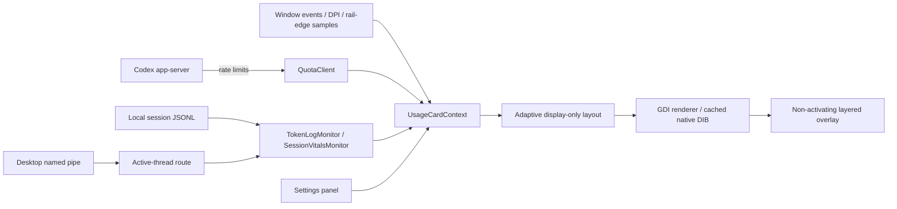

# Architecture / 架构

No web renderer is included. Quota refresh is approximately once a minute while displayed; the helper exits after a read. Session polling is every 500 ms while visible, with bounded/coalesced file notifications. Route changes immediately clear old metrics. Quota reads run independently, and stale session results are discarded. Multiple subscriptions trigger a recent-activity selection among local subscribed sessions. Without IPC candidates, the latest desktop session is used. The details panel labels the fallback, which is not proof of the foreground chat. Foreground/window events drive visibility and geometry, with fallback checks. Animation timers stop at completion. Configuration edits are debounced and trigger live preview only when changed.

没有网页渲染器。显示时约每分钟读额度，辅助进程读取后退出；显示时会话每 500 毫秒检查，文件通知合并且有上限；路由变化立即清除旧指标，额度独立读取，过期会话结果丢弃。多个订阅时按本地订阅会话的最近活动选择；没有 IPC 候选时回退到最近桌面会话。详情标注回退来源，不将其视为前台聊天身份的证明。窗口事件驱动可见性与位置，另有补偿检查。动画结束即停止，设置预览由变更触发。

Namespaces, the configuration directory, startup registry key and single-instance mutex retain prototype names to keep existing preferences/startup behavior compatible. The public assembly and project are named Codex Rail. Session-log parsing and desktop IPC are version-sensitive; they are not presented as a stable extension API.

命名空间、配置目录、启动项和互斥锁保留历史标识以兼容已有设置；公开项目与程序集名为 Codex Rail。日志和 IPC 有版本依赖，不把它们宣传为稳定的插件 API。
